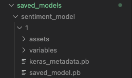
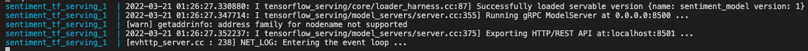

## Usage

>Instructions to download a saved model and format for serving with tensorflow serving docker image.

## Setup Model Serving

### Download the saved model

From the root directory, run the following command to create a new directory for `sentiment_model` and a nested directory named `1` the first version of that model.

```
mkdir -p ./saved_models/sentiment_model/1
```

If you followed along with the blog post, you should have a trained model saved in your google drive. Download this model.

Next unzip & save the contents of the model in the `1` directory. `./saved_models/sentiment_model/1`.

The folder structure should look like this:



### Test Tensorflow Serving Can load the model

If the model was saved in the correct format depicted above, then you should be able to run the folling to create a local REST API for model inference:

```
docker-compose up tf_serving
```

It will take a minute to load, but once you see an output like this, the REST API is exposed and ready to test:



To quickly check details on the model that was loaded by tensorflow serving, go to the following url: `http://localhost:8501/v1/models/sentiment_model/metadata`

This should return metadata related to the saved model.
